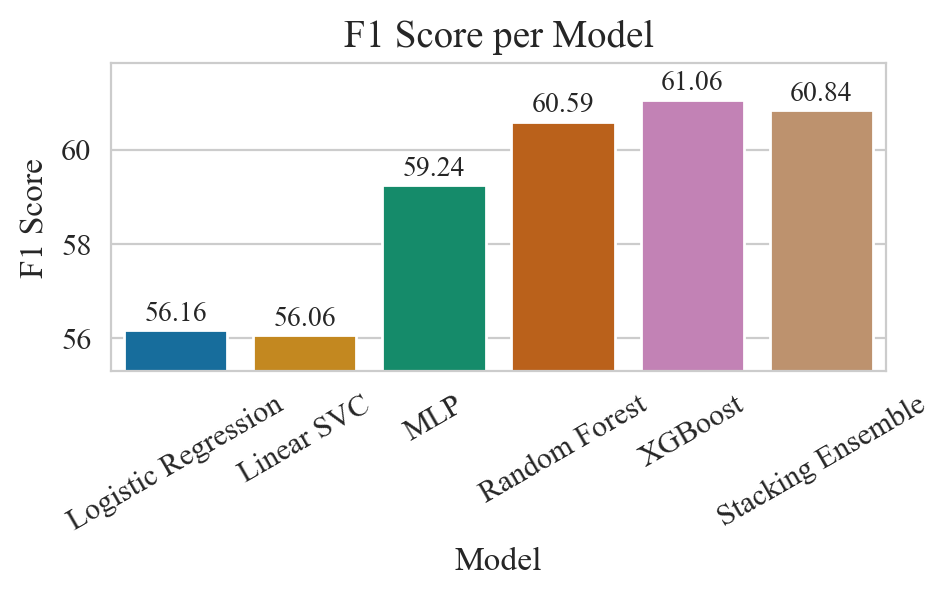

# Insurance Claim Prediction Project

This project aims to build a predictive model to determine whether a customer will submit an insurance claim during their policy period. The project utilizes automobile insurance data and various machine learning models to identify key factors that influence claim submission.

## Project Structure
This repository contains resources for predicting insurance claims, including the following files:
- **claim_prediction.ipynb**: A Jupyter notebook for model training, evaluation, and insights.
- **data_exploration.ipynb**: A Jupyter notebook showcasing data preprocessing steps and exploratory data analysis (EDA).
- **claim_prediction.py**: A Python script for training and evaluating models.
- **data_util.py**: A Python script for data preprocessing utilities.

## Data Processing and Exploration

### 1. Exploratory Data Analysis (EDA)
- **Categorical Features**: Analyzed the distribution of categorical features against the target variable (response).
  
  
  
  
  *Figure 1: Distribution of categorical features with respect to the target variable.*

- **Numerical Features**: Visualized numerical features to understand their distributions and their relation to the target variable.
  
  
  
  *Figure 2: Distribution of numerical features and their relationship with the target variable.*

### 2. Data Preprocessing

#### 2.1 Categorical Features
- **Encoding**: Categorical columns were encoded using numerical or one-hot encoding.

#### 2.2 Correlation Matrix
  - **Strong Positive Correlation with `Response`**:
    - `Previous_Vehicle_Damage`: 0.45
    - `Vehicle_Age`: 0.29
  - **Strong Negative Correlation with `Response`**:
    - `Previously_Insured`: -0.43
    - `Policy_Sales_Channel`: -0.18
  
  
  *Figure 3: Correlation matrix showing relationships between features.*

#### 2.3 Splitting the Dataset
- The dataset was split into training, validation, and testing sets to facilitate model evaluation.

#### 2.4 Numerical Features
##### 2.4.1 Handle Outliers
- **Outlier Handling**: Outliers in numerical features, particularly `Annual_Premium`, were handled using different strategies like Winsorization (capping) based on IQR or percentile methods.

  
  
  
  *Figure 4: Distribution of numerical features before and after outlier handling with IQR-based capping method.*

##### 2.4.2 Feature Scaling
- **Normalization**: Numerical features were scaled using normal/standard scaling.

  

  *Figure 5: Distribution of numerical features after scaling.*

#### 2.5 Handling Class Imbalance
- **Class Imbalance**: Techniques such as SMOTE and class weight adjustments were used to handle class imbalance in the dataset.

## Model Training and Evaluation

### 1. Models Trained
- **Logistic Regression**: A good linear baseline.
- **Linear SVC (Support Vector Classifier)**: An efficient support vector classifier with linear kernel.
- **MLP (Multi-Layer Perceptron)**: A simple neural network for potential non-linear relationship learning.
- **Random Forest**: An ensemble model for better capturing non-linearities.
- **XGBoost**: An optimized gradient boosting framework.
- **Stacked Ensemble**: An ensemble model combining predictions from MLP, Random Forest, and XGBoost classifiers.

### 2. Hyperparameter Tuning
- **GridSearchCV** and **RandomizedSearchCV** was used for hyperparameter tuning across different models to optimize their performance.

### 3. Model Performance Metrics
- **Evaluation Metrics**: The models were evaluated using `ROC AUC`, `Precision`, `Recall`, and `F1 Score` to measure both overall and class-specific performance.

  
  
  
  *Figure 6: Model performance comparison.*

### 4. Results and Observations
- **Outlier Handling Impact**: Logistic Regression, Random Forest, and XGBoost showed minimal sensitivity to the outlier strategy. MLP performed worse when capping outliers, suggesting it may not be robust to outlier handling.
  
  
  
  
  *Figure 7: Impact of different outlier handling strategies on model performance.*

- **Class Imbalance Handling Impact**: Handling class imbalance slightly improved linear models, with Class Weight performing better than SMOTE. However, Random Forest and XGBoost showed a drop in performance when using class balancing strategies, indicating they are inherently robust to imbalanced datasets.

  
  
  
  *Figure 8: Impact of class imbalance handling strategies on different models.*

### 5. Feature Importance
#### 5.1 Model-specific Ranked Features
- **Feature Importance**: `Previous_Vehicle_Damage`, `Previously_Insured`, `Age`, `Policy_Sales_Channel`, and `Vehicle_Age` were identified as the top predictors across models.

  
  
  *Figure 9: Model-specific ranked feature importance.*

#### 5.2 Permutation Feature Importance (PFI) Ranked Features
- Top-5 most impactful features on model performance according to PFI measure in average:
    - `Previous_Vehicle_Damage`: Consistently ranked as the most important across all models. Customers with prior vehicle damage have a much higher likelihood of submitting a claim. 
    - `Previously_Insured`: Being previously insured with the company was a strong predictor of claim submission.
    - `Age`: Customer experience and potential risk factors associated with different age groups impact claim behavior.
    - `Policy_Sales_Channel`: The sales channel used to purchase the policy influences claim submission behavior.
    - `Vehicle_Age`: Older vehicles are more likely to be involved in claims.

  
  
  *Figure 9: PFI ranked feature importance across models.*

## Conclusion
- **Model Performance**: The tree-based models (Random Forest and XGBoost) consistently outperformed others, with XGBoost achieving the highest `ROC AUC` and `F1` score of 89.53 and 60.84 respectively.
- **Feature Insights**: Features such as `Previous_Vehicle_Damage`, `Previously_Insured`, `Age`, `Policy_Sales_Channel`, and `Vehicle_Age` were strong predictors.

## How to Run
1. **Dependencies**: Install dependencies using `requirements.txt`.
3. **Model Training**: Run `claim_prediction.py` to perform data preprocessing, model trainining, selection, and evaluattion.

## License
This project is licensed under the [MIT License](LICENSE).
